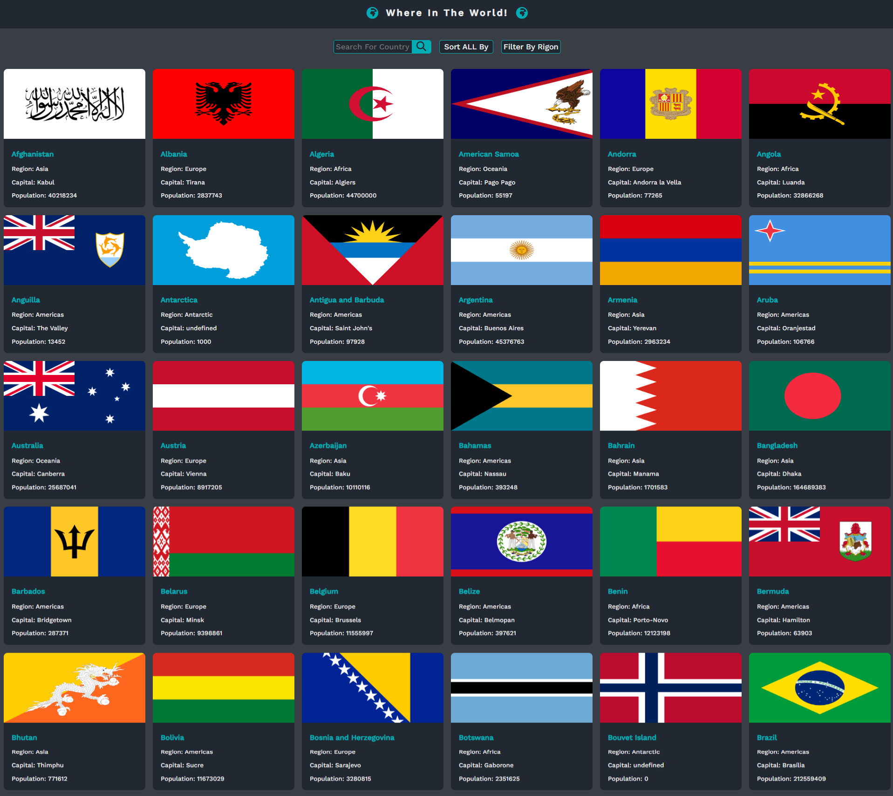
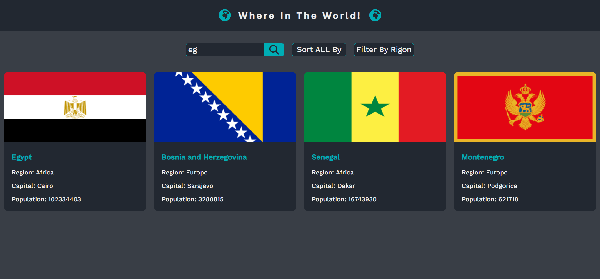
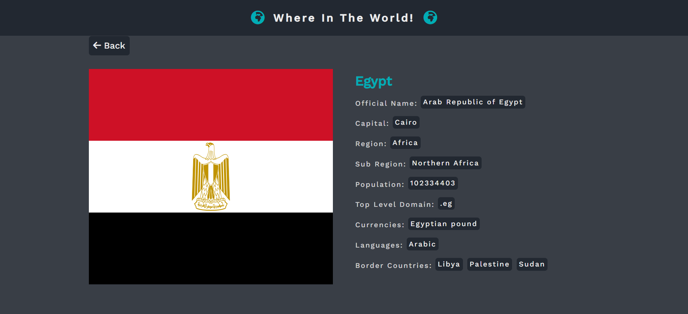
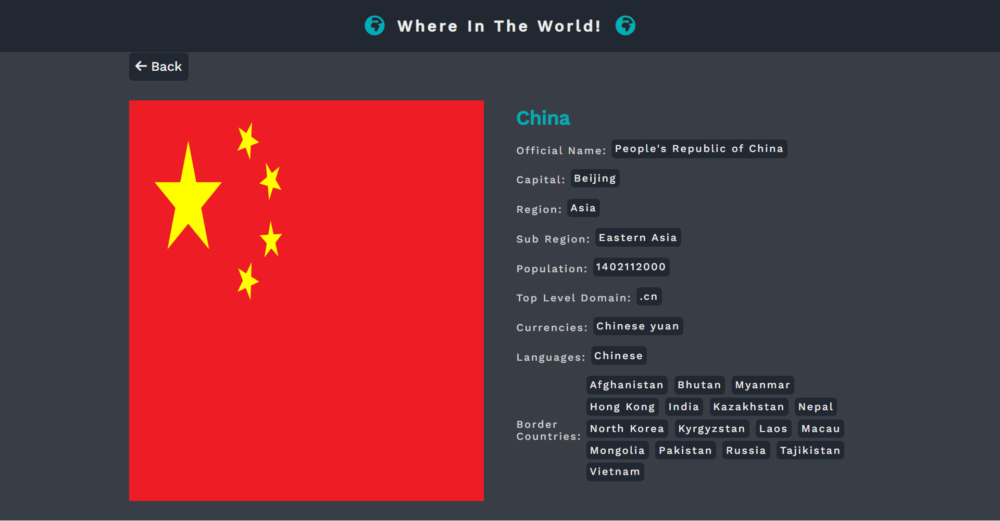

# where In The World
    - Do you need knowledge about countries worldwide here is our project.
    - "Where in the World" is a dynamic web application designed to provide comprehensive information about countries across the globe.
    - Leveraging the REST Countries API, this project seamlessly integrates real-time data to empower users with an immersive exploration experience.

# Key Features :-
    🌍 Global Country Database: This responsive site showcases all the world's countries and their information sourced from the REST Countries API.
    🔍 Effortless Search Functionality: Users can easily search for countries by name, displaying all countries with related subnames for quick access.
    🔄 Sort and Organize with Style: Sort countries alphabetically, by population, or by various criteria such as currencies, languages, or number of borders, from highest to lowest.
    🗺️ Explore by Region: Filter countries by region, including Africa, Asia, Americas, Europe, or view all countries collectively.
    🗺️ Immersive Country Profiles: Clicking on any country opens a new page displaying detailed information such as flag, name, official name, capital, region, subregion, population, top-level domain, currencies, 
        languages, and border countries.
    🚀 Seamless Navigation: Navigate between countries effortlessly, with the ability to click on border countries to explore further, creating a seamless browsing experience.
    📱 Responsive Design: Experience optimal interface layouts tailored to various screen sizes, ensuring a consistent and user-friendly experience across devices.
    🌟 Enhanced User Experience: Enjoy hover and focus states for interactive elements on the page, providing a delightful browsing experience.

# Covered Topics :-
    🌐 HTML5
    🎨 CSS3
    💻 JavaScript
    🚀 ES6
    🔍 DOM - BOM - JSON
    🌍 REST Countries API

## It's an advanced Challenge from [frontendmentor](https://www.frontendmentor.io/challenges/rest-countries-api-with-color-theme-switcher-5cacc469fec04111f7b848ca)

## Live Demo: [Where in the World Live Demo](https://ahmedsaa3d.github.io/where-In-the-World/)

## GitHub Repository: [Where in the World GitHub Repository](https://github.com/AhmedSaa3d/where-In-the-World)

## Site ScreenShot :

