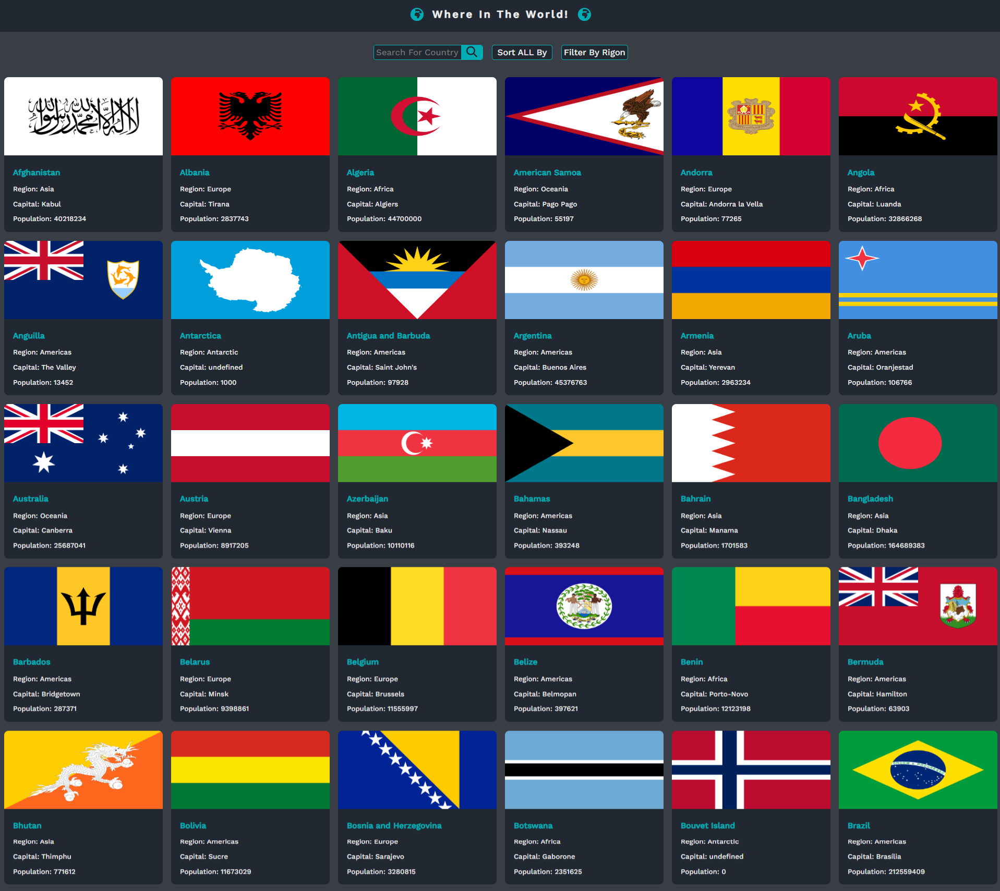
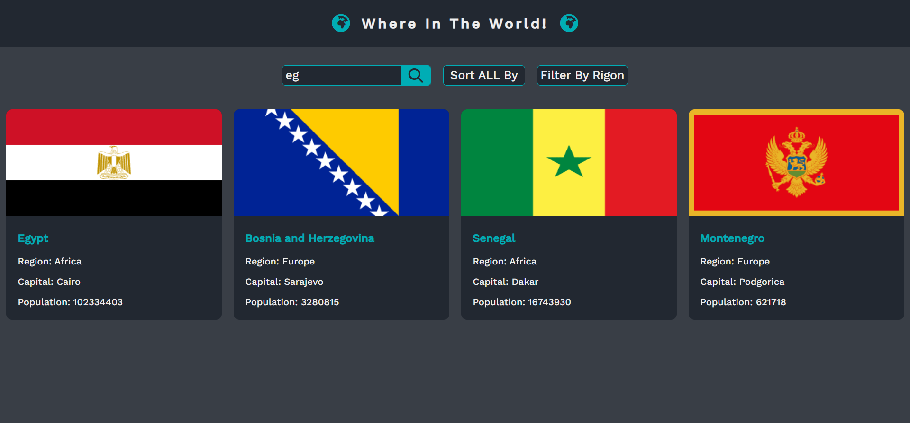

# where In The World
    - This is a responsive site to display all the world's countries and it's information from REST Countries API.
    - user show all the world's countries.
    - user can search for a country name and display all countries with related subName.
    - user can sort all the countries by nameA->Z/ population/ more currencies/ more languages/ more borders from highest to lowest.
    - user can filter the countries by region (Africa/ Asia/ Americas/ Europ/ All).
    -  when click in any country, it's open a new page desplay more information about selected country.
    -  the informationn like (flag/ name/ official name/ capital/ regino/ sub region/ population/ top level domain/ currencies/ langauges/ border countries).
    -  WHEN CLICK in any border country it's open this country page and soon on every time click it's do this.

# [It's an advanced Challenge from frontendmentor](https://www.frontendmentor.io/challenges/rest-countries-api-with-color-theme-switcher-5cacc469fec04111f7b848ca)

# Covered Topics :
    - html5
    - css3
    - javaScript
    - Es6
    - Dom - Bom - Json
    - REST Countries API

# Live Site :
     [Visit Where In The World](https://ahmedsaa3d.github.io/where-In-the-World/)

# Site ScreenShot :

